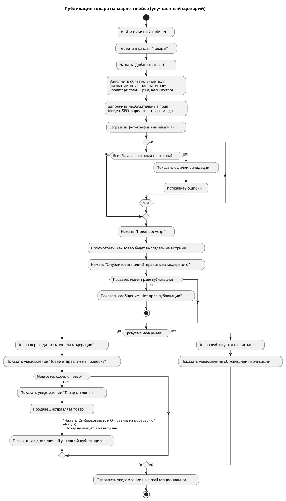

# Формулировка требований к функциональности «Публикация товара на маркетплейсе»

## Верхнеуровневая постановка (User Story)

**As a** продавец в Личном кабинете

**I want** опубликовать свой товар на витрине маркетплейса

**So that** покупатели смогут его найти, просмотреть и купить, а я получу дополнительные продажи.

### Критерии приёмки (Acceptance Criteria)

- Продавец может создать новый товар с нуля или на основе шаблона/черновика.
- Все обязательные поля товара должны быть заполнены корректно перед публикацией.
- После успешной публикации товар появляется на витрине маркетплейса в течение разумного времени (не более 5 минут).
- Продавец получает уведомление об успешной публикации или об ошибках.
- Опубликованный товар соответствует правилам и политике маркетплейса (модерация, если требуется).
- Продавец может снять товар с публикации или отредактировать его после публикации.

## Требования в формате Use Case

### Use Case 1: Публикация нового товара на маркетплейсе

**Actor:** Продавец (авторизованный пользователь Личного кабинета)

**Preconditions:**
- Продавец зарегистрирован и авторизован в Личном кабинете.
- У продавца есть активный договор с маркетплейсом (разрешена продажа товаров).

**Main Flow (основной сценарий):**

1. Продавец заходит в раздел «Товары» или «Каталог» Личного кабинета.
2. Продавец нажимает кнопку «Добавить товар» или «Опубликовать новый товар».
3. Система открывает форму создания товара.
4. Продавец заполняет **обязательные поля**:
   - Название товара
   - Описание (краткое и полное)
   - Категория (выбор из справочника маркетплейса)
   - Основные характеристики (артикул, бренд, модель и т.д.)
   - Цена (розничная, возможно акционная)
   - Количество на складе (или доступность)
   - Фотографии товара (минимум 1, максимум по правилам платформы)
   - Дополнительные атрибуты в зависимости от категории (размер, цвет, вес и т.д.)
5. Продавец заполняет **необязательные поля** (видео, SEO-метаданные, варианты товара и т.д.).
6. Продавец нажимает кнопку «Предпросмотр».
7. Система показывает, как товар будет выглядеть на витрине.
8. Продавец нажимает кнопку «Опубликовать» или «Отправить на модерацию».
9. Система выполняет валидацию данных.
10. Если валидация пройдена:
    - Товар сохраняется в статусе «Опубликован» (или «На модерации», если требуется).
    - Товар появляется на витрине маркетплейса.
    - Продавцу показывается уведомление об успехе и ссылка на опубликованный товар.
11. Система отправляет уведомление продавцу (в ЛК и/или на e-mail).

**Alternative Flows (альтернативные сценарии):**

**A1. Ошибки валидации** (на шаге 9):
- Система выделяет поля с ошибками и выводит сообщения (например, «Обязательное поле не заполнено», «Фотография не соответствует требованиям»).
- Продавец исправляет ошибки и повторяет шаг 8.

**A2. Требуется модерация:**
- После нажатия «Опубликовать» товар переходит в статус «На модерации».
- Продавец получает уведомление: «Товар отправлен на проверку, ожидайте».
- После одобрения модератором товар публикуется автоматически.

**A3. Создание черновика:**
- На любом шаге продавец может нажать «Сохранить как черновик».
- Товар сохраняется в статусе «Черновик» и может быть продолжен позже.

**Exception Flows (исключения):**

**E1. Продавец не имеет права публикации** (договор неактивен, блокировка):
- Система блокирует кнопку публикации и показывает сообщение с причиной.

**E2. Техническая ошибка** (проблема с загрузкой фото, таймаут):
- Система показывает сообщение об ошибке и предлагает повторить действие.

**Postconditions:**
- Товар успешно опубликован и доступен покупателям на витрине.
- В Личном кабинете товар отображается в списке с актуальным статусом.

## Диаграммы процесса

### Диаграмма вариантов использования (Use Case Diagram)

