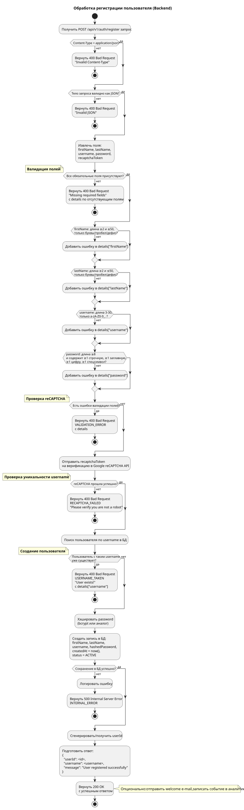

# Пошаговый алгоритм обработки регистрации пользователя на стороне бэкенд-сервиса

Ниже подробно описан алгоритм обработки запроса `POST /api/v1/auth/register`, который выполняется бэкендом после получения запроса от фронтенда при нажатии кнопки **Register**.

Алгоритм представлен в виде **Activity Diagram** (диаграммы активности) в текстовом формате PlantUML, а также в виде пошагового текстового описания.

## Диаграмма активности (PlantUML)

## Пошаговое текстовое описание алгоритма

1. **Приём и базовая проверка запроса**
   - Проверка `Content-Type: application/json`.
   - Парсинг JSON тела запроса.
   - При ошибках -> 400 Bad Request.

2. **Проверка наличия обязательных полей**
   - `firstName`, `lastName`, `username`, `password`, `recaptchaToken`.
   - При отсутствии -> 400 с details.

3. **Валидация значений полей**
   - Правила для каждого поля (длина, формат, состав пароля).
   - Сбор всех ошибок в `details`.
   - При наличии ошибок -> 400 VALIDATION_ERROR.

4. **Верификация reCAPTCHA**
   - Отправка токена в Google reCAPTCHA API.
   - При неудаче -> 400 RECAPTCHA_FAILED.

5. **Проверка уникальности username**
   - Поиск в БД по `username`.
   - При совпадении -> 400 USERNAME_TAKEN.

6. **Создание пользователя**
   - Хэширование пароля (bcrypt).
   - Вставка записи в БД.
   - При ошибке БД -> 500 Internal Server Error.

7. **Успешный ответ**
   - Возврат 200 OK с `userId`, `username` и сообщением.

8. **Дополнительные действия** (асинхронно)
   - Отправка welcome-письма, логирование события.
